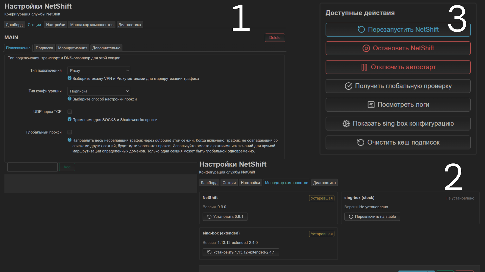

<div align="center">

# NetShift

<p align="center">
  
  <br>
  <br>
  <a href="https://github.com/yandexru45/netshift/releases">
    
  </a>
</p>
<h3 align="center"><a href="https://github.com/sagernet/sing-box">Sing-box</a> client for Openwrt</h3>
</div>

---
<p align="center">
  <a href="https://t.me/netshift_news"></a>
  <a href="https://t.me/netshift_chat"></a>
</p>

---

**NetShift** - маршрутизатор трафика для OpenWrt. Направляйте нужные ресурсы в туннель, а остальное - напрямую. Открытое ПО на базе [sing-box](https://github.com/SagerNet/sing-box).

Это форк [itdoginfo/podkop](https://github.com/itdoginfo/podkop), значительно расширяющий функциональность.

> [!WARNING]
> Проект находится в стадии бета-версии. Возможны ошибки, нестабильная работа и существенные изменения функциональности.

---

## Функции

- [x] **Маршрутизация по доменам и подсетям** - нужное в туннель, остальное напрямую<br><sub>VLESS · Shadowsocks · Trojan · Hysteria2 · VMess · SOCKS · готовые community-списки</sub>
- [x] **Subscription URL** - ссылки подписки от провайдера с автообновлением и автовыбором лучшего сервера<br><sub>любая подписка remnawave · 3x-ui · marzban · github · форматы base64 / URI / Clash / Xray JSON</sub>
- [x] **Несколько подписок и фильтры** - несколько фидов в одной секции, фильтр серверов по ключевым словам (include / exclude)<br><sub>объединение без дублей · регистронезависимо · работает и по эмодзи</sub>
- [x] **Группировка серверов** - по флагу страны или по префиксу имени, с авто-выбором «⚡ Самый быстрый» среди всех групп<br><sub>URLTest внутри группы · URLTest над группами · ручной выбор сохранён</sub>
- [x] **Переключаемое ядро sing-box** - стабильное ↔ sing-box-extended прямо из веб-интерфейса<br><sub>клиентский транспорт xhttp · самовосстановление и автооткат · установка в один клик</sub>
- [x] **Самообновление из веб-интерфейса** - проверка и установка обновлений NetShift прямо из LuCI<br><sub>асинхронно · бэкап конфига · без риска «окирпичивания»</sub>
- [x] **Веб-интерфейс LuCI** - дашборд, менеджер компонентов, диагностика и настройки без ручной правки конфигов<br><sub>статус серверов · проверка соединения · логи · вкладки-карточки</sub>
- [x] **IPv6, блокировка DoH, глобальный прокси** - полная маршрутизация v6 через туннель, защита DNS роутера, режим «весь трафик в туннель»<br><sub>v6 tproxy / DNS / FakeIP · DNS через прокси · фоновый watchdog sing-box</sub>
- [x] **Автоматическая миграция** - обновление со старого podkop переносит конфиг без перенастройки


---

<div align="center">



</div>

---

## Вещи, которые необходимо знать перед установкой

<details open>
<summary><b>Системные требования</b></summary>

- OpenWrt **24.10** или выше (поддерживаются и сборки на `opkg`/`.ipk`, и новые на `apk`/`.apk` - OpenWrt 25.12+).
- Минимум **25 МБ** свободного места. Устройства с флеш-памятью 16 МБ не поддерживаются.
- На устройстве: `sing-box >= 1.12.0`, `jq >= 1.7.1`, `coreutils-base64 >= 9.7` (ставятся как зависимости пакета).

</details>

<details>
<summary><b>Обновления и конфигурация</b></summary>

- При обновлении **обязательно** [очищайте кэш LuCI](https://podkop.net/docs/clear-browser-cache/).
- После обновления проверяйте конфигурацию - она может меняться между версиями.
- При старте NetShift модифицирует конфигурацию Dnsmasq.
- NetShift изменяет конфигурацию sing-box. Если используете собственную - заранее сохраните её.

</details>

<details>
<summary><b>Ограничения и особенности</b></summary>

- Если установлен **Getdomains**, его [необходимо удалить](https://github.com/itdoginfo/domain-routing-openwrt?tab=readme-ov-file#скрипт-для-удаления).
- **Dashboard** работает только по HTTP (особенность Clash API). По HTTPS или через домен может быть недоступен.

</details>

<details>
<summary><b>Поддержка и диагностика</b></summary>

- [Руководство по диагностике](https://podkop.net/docs/diagnostics/)
- Актуальные изменения - в [Telegram-чате](https://t.me/netshift_chat/2) (читайте закреплённые сообщения).
- При проблемах оставляйте технически грамотный фидбэк в GitHub Issues и Telegram-чате.

</details>

<details>
<summary><b>Миграция с podkop (0.8.0) и смена формата конфига (0.7.0)</b></summary>

**0.8.0 - переименование в NetShift.** Пакет теперь `netshift` (бинарь `/usr/bin/netshift`), конфиг - `/etc/config/netshift`, LuCI-приложение - `luci-app-netshift`. При обновлении старый конфиг `/etc/config/podkop` автоматически мигрируется в `/etc/config/netshift`, резервная копия сохраняется в `/etc/config/podkop.bak.pre-netshift`. туннель продолжит работать без перенастройки.

**0.7.0 - несовместимый формат конфига.** Старые значения несовместимы - нужно настроить заново. Скрипт установки обнаружит старую версию и предложит сделать это автоматически. Вручную:

```sh
mv /etc/config/netshift /etc/config/netshift-070
wget -O /etc/config/netshift https://raw.githubusercontent.com/yandexru45/netshift/refs/heads/main/netshift/files/etc/config/netshift
# затем настроить заново через LuCI или UCI
```

</details>

## Установка NetShift

Полная инструкция - в [документации](https://podkop.net/docs/install/).

Для установки и обновления достаточно одного скрипта:

```sh
sh <(wget -O - https://raw.githubusercontent.com/yandexru45/netshift/refs/heads/main/install.sh)
```

Интерфейс появится в LuCI: **Services → NetShift**.

<details>
<summary><b>Готовые community-списки</b></summary>

Готовые наборы доменов/подсетей, которые можно добавить в секцию через `community_lists` (в UI - чекбоксами). Списки обновляются автоматически:

`russia_inside` · `russia_outside` · `ukraine_inside` · `geoblock` · `block` · `porn` · `news` · `anime` · `youtube` · `hdrezka` · `tiktok` · `google_ai` · `google_play` · `hodca` · `discord` · `meta` · `twitter` · `cloudflare` · `cloudfront` · `digitalocean` · `hetzner` · `ovh` · `telegram` · `roblox`

```sh
uci add_list netshift.my_sub.community_lists='youtube'
uci add_list netshift.my_sub.community_lists='telegram'
uci commit netshift
```

</details>

<details>
<summary><b>Настройка подписки (Subscription URL) через UCI</b></summary>

Поддерживаются любые подписки (remnawave · 3x-ui · marzban · github) в форматах **base64 · список URI · Clash · Xray JSON**, в т.ч. **gzip-сжатые** ответы. При скачивании подписки отправляются заголовки:

| Заголовок | Значение |
|---|---|
| `User-Agent` | подбирается автоматически (`singbox/<версия>` или клиентский, см. формат) |
| `X-HWID` | уникальный идентификатор роутера |
| `X-Device-OS` | `OpenWrt Linux` |
| `X-Device-Model` | модель роутера |
| `X-Ver-OS` | версия ядра |

```sh
uci set netshift.my_sub=section
uci set netshift.my_sub.connection_type='proxy'
uci set netshift.my_sub.proxy_config_type='subscription'
uci set netshift.my_sub.subscription_url='https://your-provider.com/api/sub'
uci set netshift.my_sub.subscription_update_interval='1h'
uci add_list netshift.my_sub.community_lists='russia_inside'
uci commit netshift
```

**Несколько подписок** в одной секции - добавьте `subscription_url` списком (в UI - поле с «+»); все фиды скачиваются и объединяются в один набор узлов без дублей:

```sh
uci add_list netshift.my_sub.subscription_url='https://provider-a.com/sub'
uci add_list netshift.my_sub.subscription_url='https://provider-b.com/sub'
```

**Фильтр серверов** по ключевым словам - белый/чёрный список (регистр не важен, работает и по эмодзи):

```sh
uci add_list netshift.my_sub.subscription_filter_include='🇩🇪'
uci add_list netshift.my_sub.subscription_filter_exclude='trial'
```

**Группировка серверов** - собирает узлы в URLTest-группы и добавляет авто-выбор «⚡ Самый быстрый» среди всех групп (при ≥2 группах он же выбор по умолчанию; ручной выбор группы сохраняется):

```sh
# off | country (по флагу страны) | prefix (по первым N символам имени)
uci set netshift.my_sub.subscription_group_mode='country'
# для prefix: сколько первых символов имени брать (по умолчанию 2)
uci set netshift.my_sub.subscription_group_prefix_len='2'
```

**Предпочтительный формат** - для панелей, которые отдают нужные узлы (например xhttp / Hysteria2) только под определённым клиентом:

```sh
# auto | xray (Xray JSON, UA как у Happ) | singbox
uci set netshift.my_sub.subscription_format_preference='auto'
```

**Подписки по IP-хосту и «кривой» HTTPS** - можно указать подписку с IP вместо домена (например `https://22.23.43.52:2096/sub/xxxx`); для панелей с самоподписанным / несовпадающим сертификатом включите небезопасный TLS:

```sh
uci set netshift.my_sub.subscription_allow_insecure='1'
```

Ручное обновление подписки и очистка кеша:

```sh
/usr/bin/netshift subscription_update          # перечитать и применить
# Очистка кеша всех подписок и повторное скачивание - кнопка во вкладке «Диагностика»
```

</details>

<details>
<summary><b>Менеджер компонентов: ядро sing-box-extended (xhttp) и самообновление</b></summary>

Вкладка **Менеджер компонентов** в LuCI управляет NetShift и ядром sing-box в одном месте - три карточки: **NetShift** / **sing-box (stock)** / **sing-box (extended)**. Установленная версия видна сразу, статус (актуально / устарело / не установлено) и кнопка «Проверить обновление» - по нажатию.

**Переключение ядра** между стабильным sing-box и сборкой **sing-box-extended**:

- **Install extended** - расширенное ядро (даёт клиентский транспорт **xhttp**, только клиентский режим). Также поддерживается **VMess**.
- **Install stable** - вернуться на стабильное ядро.

Смена ядра безопасна: перед переключением проверяется и при необходимости чинится связь, делается бэкап; при сбое - **автооткат**, роутер никогда не остаётся без рабочего ядра. По умолчанию стоит стабильное - extended включается по желанию.

**Самообновление NetShift** - кнопка обновления прямо из веб-интерфейса: асинхронно, с бэкапом конфига, проверкой фактической версии после установки и без риска «окирпичивания». Русская локализация обновляется только если уже установлена.

</details>

<details>
<summary><b>Дополнительные настройки (IPv6, блокировка DoH, глобальный прокси, DNS через прокси)</b></summary>

Все опции - в секции `settings` (`0` - выкл, `1` - вкл):

```sh
# Полная маршрутизация IPv6 через туннель (v6 tproxy / DNS / FakeIP). По умолчанию выкл.
uci set netshift.settings.enable_ipv6='1'

# Блокировка DoH: клиенты в сети не обойдут DNS роутера через DNS-over-HTTPS
# (режет известные DoH-эндпоинты IPv4 + IPv6 на уровне маршрутов sing-box).
uci set netshift.settings.block_doh='1'

# Глобальный прокси: ВЕСЬ трафик через выбранный outbound (а не только избранное).
# Только при явном включении - иначе действует выборочная маршрутизация.
uci set netshift.settings.global_proxy='1'

# DNS через прокси (detour): DNS-запросы идут через туннель.
uci set netshift.settings.dns_via_outbound='1'

# Блокировать QUIC (заставляет приложения откатываться на TCP/TLS).
uci set netshift.settings.disable_quic='1'

uci commit netshift
```

> По умолчанию NetShift гонит в sing-box **только** проксируемые подсети/домены, остальное - напрямую (выборочная маркировка). Режим «весь трафик в туннель» включается **только** опцией `global_proxy`.

</details>

## История изменений

Полный список изменений по версиям - на странице [Releases](https://github.com/yandexru45/netshift/releases). Анонсы обновлений публикуются в [Telegram-канале](https://t.me/netshift_news).

Коротко о крупных вехах:

| Версия | Главное |
|---|---|
| **0.9.1** | Авто-выбор «⚡ Самый быстрый» среди групп (URLTest над URLTest'ами) |
| **0.9.0** | Меньше ошибок «лимит GitHub API» (обход через redirect-путь github.com); фикс старого `option subscription_url` |
| **0.8.9** | Универсальная группировка подписки (страна / префикс имени); поддержка gzip-подписок; фикс ложного «версия устарела» |
| **0.8.7-0.8.8** | Критфикс маршрутизации 2-й секции; выборочная маркировка (меньше нагрузки CPU); Hysteria2 + xhttp везде; несколько подписок; надёжное самообновление |
| **0.8.6** | IPv6 · блокировка DoH · вкладка «Менеджер компонентов» · самообновление · подписки по IP / небезопасный TLS · глобальный прокси · DNS через прокси · watchdog |
| **0.8.5** | VMess (extended) · надёжная смена ядра с автооткатом · фильтр серверов по ключевым словам · Xray JSON + автоподбор User-Agent |
| **0.8.0** | Переименование podkop → NetShift с авто-миграцией конфигов; sing-box-extended (xhttp) из веб-интерфейса |

## Project Structure

```
.
├── netshift/                       # Бэкенд-пакет (POSIX ash + jq)
│   ├── Makefile                    # Описание OpenWrt-пакета
│   └── files/
│       ├── etc/config/netshift     # UCI-конфиг по умолчанию
│       ├── etc/init.d/netshift     # procd init-скрипт
│       └── usr/
│           ├── bin/netshift        # Точка входа CLI (диспетчер команд)
│           └── lib/                # constants, helpers, nft, rulesets,
│                                   #   sing_box_config_*, updater, logging
│
├── luci-app-netshift/              # LuCI веб-интерфейс
│   ├── Makefile
│   ├── htdocs/.../view/netshift/   # main.js (автоген) + hand-written views
│   ├── po/                         # Переводы (генерируются из fe-app)
│   └── root/                       # menu.d · acl.d · uci-defaults
│
├── fe-app-netshift/                # TypeScript-исходник для main.js (tsup)
│   ├── src/netshift/               # fetchers · methods · services · tabs
│   ├── src/{validators,helpers,icons,partials}
│   └── locales/                    # Исходные переводы (netshift.pot / .po)
│
├── sdk/                            # Базовые образы OpenWrt SDK
├── Dockerfile-ipk · Dockerfile-apk # Сборка пакетов
└── install.sh                      # Установщик + миграция с podkop
```

## Build Artifacts

Пакеты собираются в Docker-образах OpenWrt SDK (`.ipk` - 24.10, `.apk` - 25.12) и публикуются как релиз при push git-тега ([`.github/workflows/build.yml`](.github/workflows/build.yml)).

| Пакет | Формат | Назначение |
|---|---|---|
| `netshift` | `.ipk` / `.apk` | Бэкенд: CLI, init-скрипт, библиотеки, UCI-конфиг |
| `luci-app-netshift` | `.ipk` / `.apk` | Веб-интерфейс LuCI |
| `luci-i18n-netshift-ru` | `.ipk` / `.apk` | Русская локализация интерфейса |

Локальная сборка:

```sh
# ipk (OpenWrt 24.10, opkg)
docker build -f Dockerfile-ipk --build-arg NETSHIFT_VERSION=0.9.1 -t netshift:ipk .

# apk (новые сборки OpenWrt 25.12+, apk)
docker build -f Dockerfile-apk --build-arg NETSHIFT_VERSION=0.9.1 -t netshift:apk .
```

> Требуется sing-box >= 1.12.0, jq >= 1.7.1 и coreutils-base64 >= 9.7 на целевом устройстве.

## Star History

<a href="https://www.star-history.com/#yandexru45/netshift&Date">
 <picture>
   <source media="(prefers-color-scheme: dark)" srcset="https://api.star-history.com/svg?repos=yandexru45/netshift&type=Date&theme=dark" />
   <source media="(prefers-color-scheme: light)" srcset="https://api.star-history.com/svg?repos=yandexru45/netshift&type=Date" />
   
 </picture>
</a>

## Credits

- [itdoginfo/podkop](https://github.com/itdoginfo/podkop) - исходный проект, форком которого является NetShift.
- [sing-box](https://github.com/SagerNet/sing-box) - движок маршрутизации.

Лицензия: **GPL-2.0-or-later** - см. [LICENSE](LICENSE).

> [!IMPORTANT]
> Pull Request принимаются только после согласования с авторами в [Telegram-чате](https://t.me/netshift_chat/17).
